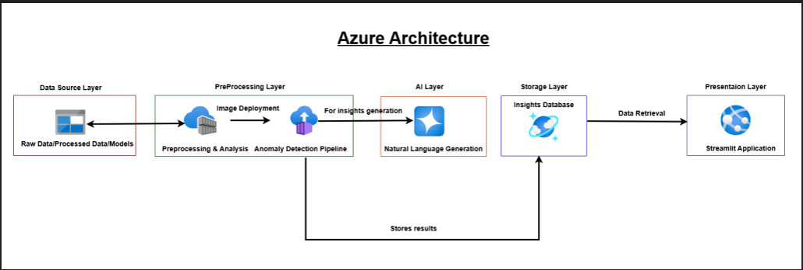
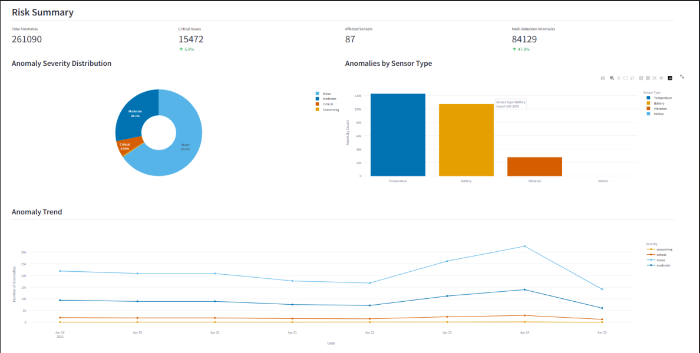
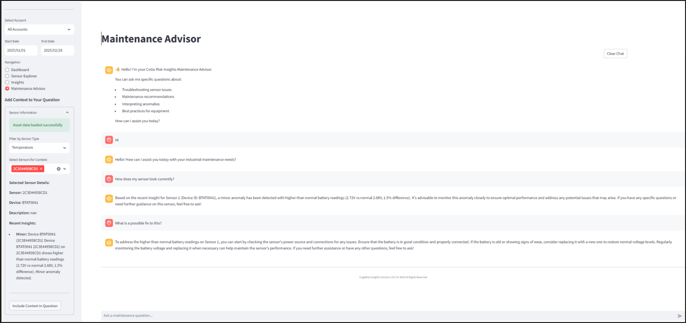

# Risk Insight Virtual Assistant (RIVA)

An AI-powered framework for anomaly detection in industrial IoT sensor networks with natural language insights generation.

## Architecture Overview





*Figure 1: The system architecture showing data flow from source to presentation*

## Overview

The Risk Insight Virtual Assistant is a comprehensive IoT anomaly detection and insight generation system designed to identify, analyze, and communicate potential issues across industrial sensor networks. By combining statistical, machine learning, and time-series analysis techniques with graph-based relationship modeling, RIVA provides actionable insights for proactive maintenance and risk mitigation.

## Key Features

- **Multi-stage Anomaly Detection**: Cascading filters (statistical → Isolation Forest → time-series) for precise anomaly identification
- **Graph-based Relationship Analysis**: Identifies connected anomalies across sensor networks to help pinpoint root causes
- **Natural Language Insights**: Transforms technical findings into actionable human-readable narratives
- **Interactive Streamlit Application**: Dashboard, sensor explorer, and AI-powered maintenance advisor
- **Memory-efficient Processing**: Optimized for large sensor networks with resource constraints
- **Account-based Views**: Organizes insights by client account for tailored perspectives

## Interactive Application

The system includes an interactive Streamlit application with multiple views:

### Dashboard View



*Figure 3: Dashboard showing anomaly distribution and trends*

### Maintenance Advisor



*Figure 2: AI-powered maintenance advisor providing contextual troubleshooting assistance*

## Repository Structure

```
/
├── data/                    # Sample data files
├── notebook/                # Jupyter notebooks for exploration and development
├── src/                     # Source code
│   ├── azure_deployment/    # Backend anomaly detection pipeline
│   └── streamlitapp/        # Interactive Streamlit application
└── README.md                # This file
```

## Installation

### Prerequisites

- Python 3.9 or higher
- Docker (for containerized deployment)
- Azure account (for cloud deployment)

### Local Setup

```bash
# Clone the repository
git clone https://github.com/yourusername/risk-insights.git
cd risk-insights

# Set up backend environment
cd src/azure_deployment
python -m venv venv
source venv/bin/activate  # On Windows: venv\Scripts\activate
pip install -r requirements

# Set up Streamlit application
cd ../streamlitapp
python -m venv venv
source venv/bin/activate  # On Windows: venv\Scripts\activate
pip install -r requirements.txt
```

## Usage

### Running the Streamlit Application Locally

```bash
cd src/streamlitapp
streamlit run demo.py
```

### Deploying to Azure

See our [deployment guide](./docs/deployment.md) for detailed instructions on deploying to Azure.

## Anomaly Detection Pipeline

The system uses a three-stage pipeline for comprehensive anomaly detection:

1. **Statistical Detection**: Identifies point anomalies using adaptive Z-score thresholds.
2. **Isolation Forest**: Detects complex pattern anomalies using unsupervised machine learning.
3. **Time-Series Analysis**: Identifies seasonal and trend-based anomalies using exponential smoothing.

Each stage acts as a filter, with results feeding into the next stage for enhanced detection accuracy.

## Graph-Based Relationship Analysis

The system constructs a weighted graph representation of sensor relationships:
- Nodes represent sensors
- Edges represent relationships between sensors
- Edge weights combine temporal correlation (40%), spatial proximity (30%), functional dependency (20%), and anomaly co-occurrence (10%)
- Community detection algorithms identify related groups of sensors

## Natural Language Insights

RIVA generates three types of insights:
- **Short-term insights**: Immediate anomalies requiring attention
- **Long-term insights**: Trends and patterns developing over time
- **Relationship insights**: Connected anomalies across multiple sensors

Insights are tailored to different stakeholder needs with asset-specific context enhancement.

## Project Background

This project was developed as part of our Master's Capstone project at Northeastern University, focusing on industrial IoT anomaly detection and insight generation. The system demonstrates the power of combining multiple analytical techniques with graph-based relationship modeling to provide comprehensive understanding of complex sensor networks.

## Acknowledgements

We would like to thank all contributors to this project, especially the faculty advisors and industry partners who provided guidance and feedback throughout the development process.

## License

This project is released under the MIT License - see the [LICENSE](LICENSE) file for details.